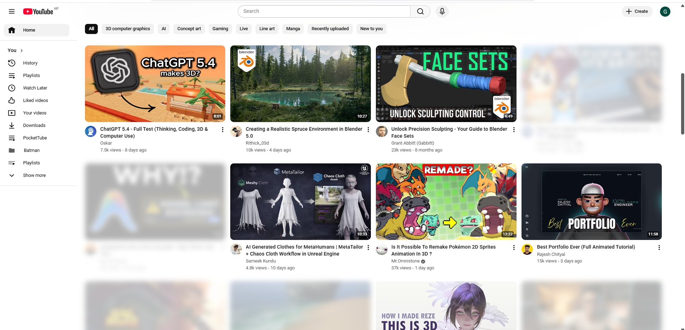
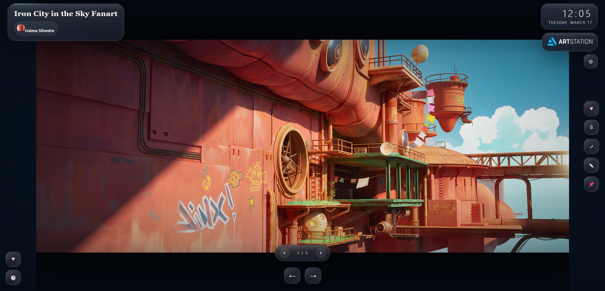
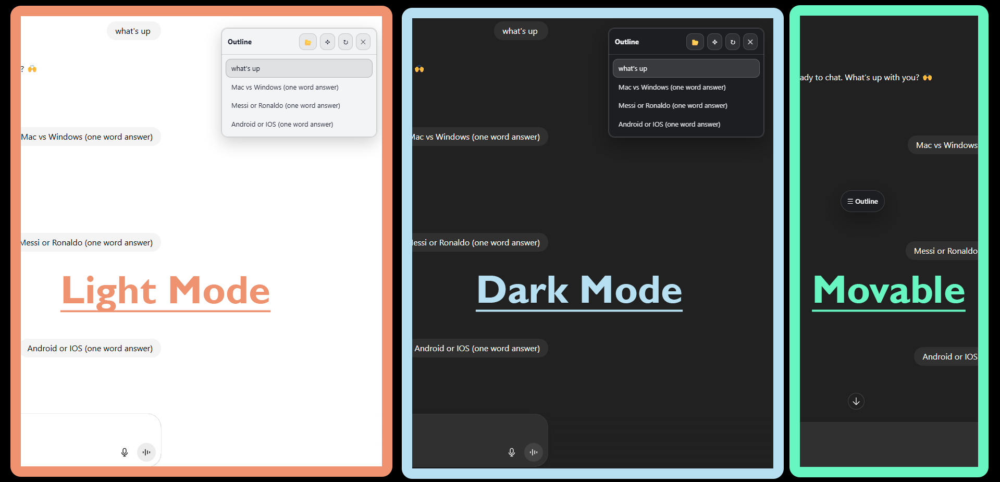

 
  

# Toji

### *GitHub-first builder shaping tools and repositories with a 3D artist's sense of form.*

 

  

Built to feel calm, clear, and work-led.

---

## Selected Repositories

<table width="100%">
  <tr>
    <td align="center" width="50%" valign="top">
      <a href="https://github.com/tojicb-fushiguro/YouTube-Filter"><strong>YouTube-Filter</strong></a>
        
      
        
      
    </td>
    <td align="center" width="50%" valign="top">
      <a href="https://github.com/tojicb-fushiguro/RefStation"><strong>RefStation</strong></a>
        
      
        
      
    </td>
  </tr>
</table>

 

<table width="100%">
  <tr>
    <td width="25%"></td>
    <td align="center" width="50%" valign="top">
      <a href="https://github.com/tojicb-fushiguro/Chat-Outline"><strong>Chat-Outline</strong></a>
        
      
        
      
    </td>
    <td width="25%"></td>
  </tr>
</table>

 

<table width="100%">
  <tr>
    <td width="33%" valign="top">
      <strong>YouTube-Filter</strong> 
      Quieter browsing through feed control and keyword filtering.
    </td>
    <td width="33%" valign="top">
      <strong>RefStation</strong> 
      An artist-leaning new-tab experience shaped by discovery, mood, and visual rhythm.
    </td>
    <td width="33%" valign="top">
      <strong>Chat-Outline</strong> 
      A structured AI workspace with draggable navigation and cleaner long-form flow.
    </td>
  </tr>
</table>

<h2 align="left">GitHub Presence</h2>

  

  &nbsp;&nbsp;&nbsp;&nbsp;&nbsp;&nbsp;&nbsp;&nbsp;&nbsp;&nbsp;&nbsp;&nbsp;&nbsp;&nbsp;&nbsp;&nbsp;&nbsp;&nbsp;&nbsp;&nbsp;&nbsp;&nbsp;&nbsp;&nbsp;&nbsp;&nbsp;&nbsp;&nbsp;&nbsp;&nbsp;&nbsp;&nbsp;&nbsp;&nbsp;&nbsp;&nbsp;&nbsp;&nbsp;&nbsp;&nbsp;&nbsp;&nbsp;&nbsp;&nbsp;&nbsp;&nbsp;&nbsp;&nbsp;&nbsp;&nbsp;&nbsp;&nbsp;&nbsp;&nbsp;&nbsp;&nbsp;&nbsp;&nbsp;&nbsp;&nbsp;&nbsp;&nbsp;&nbsp;&nbsp;&nbsp;&nbsp;&nbsp;&nbsp;&nbsp;&nbsp;&nbsp;&nbsp;&nbsp;&nbsp;&nbsp;&nbsp;&nbsp;&nbsp;&nbsp;&nbsp;&nbsp;&nbsp;&nbsp;&nbsp;&nbsp;&nbsp;&nbsp;
  
  
  

 

  

 

---
